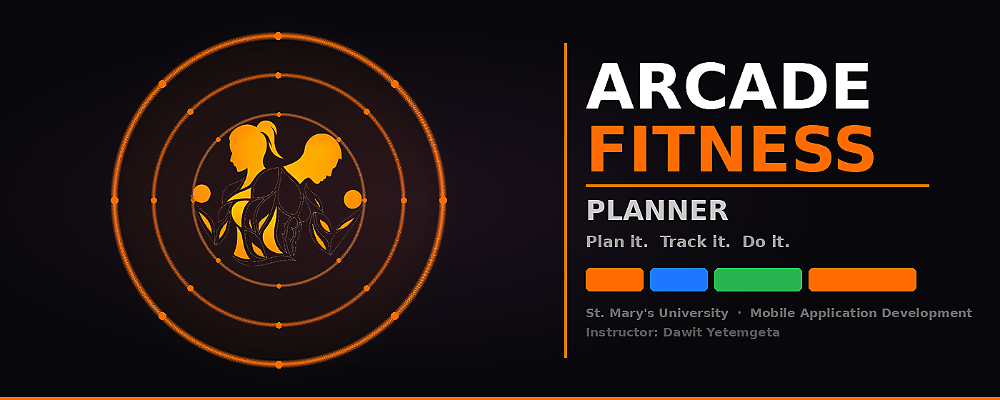

<div align="center">

# Arcade Fitness Planner

### Plan it. Track it. Do it.

<br/>


</div>

---

## Table of Contents

- [Overview](#overview)
- [Monorepo Structure](#monorepo-structure)
- [Android App](#android-app)
  - [Features](#features)
  - [Architecture](#architecture)
  - [Tech Stack](#android-tech-stack)
  - [Screens](#screens)
  - [Local Setup](#android-setup)
- [Backend API](#backend-api)
  - [API Routes](#api-routes)
  - [Infrastructure](#infrastructure)
  - [Security](#security)
  - [Local Setup](#backend-setup)
- [Database Schema](#database-schema)
- [Development Roadmap](#development-roadmap)
- [Team](#team)
- [Academic Information](#academic-information)
- [License](#license)

---

## Overview

**Arcade Fitness Planner** is a full-stack fitness tracking platform built for the **Mobile Application Development** course at **St. Mary's University**. The project consists of a native Android application and a production-grade Node.js/Express REST API with PostgreSQL.

Users can plan workouts, browse a library of exercises, track live workout sessions with set logging, monitor progress against goals, calculate BMI, manage their profile, and sync data seamlessly between the device and the cloud.

---

## Monorepo Structure

```
fitness-planner/
├── arcade-fitness-app/           # Android application (Java + Room)
│   ├── app/src/main/
│   │   ├── java/com/arcadefitness/
│   │   │   ├── activities/       # 10 screen controllers
│   │   │   ├── viewmodel/        # MVVM — 4 ViewModels
│   │   │   ├── data/
│   │   │   │   ├── local/        # Room DB — DAOs, entities
│   │   │   │   ├── repository/   # FitnessRepository + read repos
│   │   │   │   └── remote/       # Retrofit API stubs
│   │   │   ├── adapter/          # RecyclerView adapters
│   │   │   ├── network/          # Connectivity receiver
│   │   │   └── utils/            # Session, constants, validation
│   │   └── res/                  # Layouts, drawables, themes
│   └── build.gradle
│
├── arcade-fitness-backend/       # Node.js REST API
│   ├── server.js                 # Entry point
│   ├── config/db.js              # PostgreSQL connection pool
│   ├── database/schema.sql       # 7-table 3NF schema + seeds
│   ├── middleware/               # JWT auth + error handler
│   ├── controllers/              # 8 business logic modules
│   └── routes/                   # Express router definitions
│
└── README.md                     # This file
```

---

## Android App

### Features

| Feature | Description |
|---------|-------------|
| **Splash Screen** | Animated entry with app branding |
| **Authentication** | Email/password login & registration, guest access |
| **Dashboard** | Quick stats (streak, weekly volume, calories), today's workout card |
| **Workout Planner** | Create, browse, edit, and delete workout routines |
| **Exercise Library** | Browse 25 exercises, filter by muscle group |
| **Live Workout Tracking** | Timer, set logging (weight/reps), pause/resume/complete |
| **Progress Tracking** | Weekly stats, goals management, session history |
| **BMI Calculator** | Metric/imperial units, category display, progress bar |
| **User Profile** | View/edit personal info, fitness level, body metrics |
| **Dark Theme** | Full dark mode with toggle, Material Design |
| **Offline-First Sync** | Local Room DB with sync queue, auto-flush on connectivity |

### Architecture

The app follows the **MVVM (Model-View-ViewModel)** pattern with a **Repository** layer:

```
  ┌──────────────────────┐
  │  Activity / Fragment │   UI layer (no business logic)
  └─────────┬────────────┘
            │ observes LiveData / calls methods
            ▼
  ┌──────────────────────┐
  │      ViewModel       │   State holder, survives rotation
  └────────┬─────────────┘
           │
    reads  │    writes
           ▼            ▼
  ┌──────────────┐  ┌──────────────────┐
  │  Read Repos  │  │ FitnessRepository│  Transactional writes
  │  (LiveData)  │  │  + sync queue    │  + offline queue
  └──────┬───────┘  └────────┬─────────┘
         │                   │
         ▼                   ▼
  ┌──────────────────────────────┐
  │     Room Database (SQLite)   │  7 tables
  └──────────────┬───────────────┘
                 │ on connectivity
                 ▼
  ┌──────────────────────────────┐
  │  NetworkChangeReceiver       │  Auto-flush sync queue
  └──────────────┬───────────────┘
                 │
                 ▼
  ┌──────────────────────────────┐
  │  Retrofit / ApiService       │  REST → backend
  └──────────────────────────────┘
```

### Android Tech Stack

| Category | Technology |
|----------|------------|
| **Platform** | Android API 24+ (Android 7.0+) |
| **Language** | Java |
| **Architecture** | MVVM + Repository Pattern |
| **UI** | XML Layouts, Material Design Components |
| **Local Database** | Room (SQLite) — 7 entities, 7 DAOs |
| **Reactive UI** | LiveData + Observer pattern |
| **Async** | ExecutorService, Handler (main thread) |
| **Networking** | Retrofit2 + OkHttp3 |
| **Auth** | Email/password (local), Google Sign-In (stub) |
| **Security** | EncryptedSharedPreferences (AES-256-GCM) |
| **Build** | Gradle 9.0, AGP 8.10, JDK 17 |

### Screens

| Screen | Activity | Purpose |
|--------|----------|---------|
| Splash | `SplashActivity` | Animated app entry point |
| Login | `LoginActivity` | Email/password sign-in, guest access |
| Register | `RegisterActivity` | New user registration |
| Dashboard | `DashboardActivity` | Home screen with stats and quick actions |
| Workout Planner | `WorkoutPlannerActivity` | Create and browse workout plans |
| Exercise Library | `ExerciseLibraryActivity` | Browse exercises by muscle group |
| Workout Tracking | `WorkoutTrackingActivity` | Live session timer and set logging |
| Progress Tracking | `ProgressTrackingActivity` | Goals, weekly stats, session history |
| User Profile | `UserProfileActivity` | View/edit profile, settings |
| BMI Calculator | `BmiCalculatorActivity` | Calculate BMI with unit toggle |

### Android Setup

```bash
# Prerequisites: Android Studio Hedgehog+, JDK 17, Android SDK 34

# 1. Clone the repository
git clone https://github.com/c4realm/fitness-planner.git

# 2. Open the Android project
#    File → Open → arcade-fitness-app/

# 3. Sync Gradle and run
#    Run → Run 'app'  (Shift + F10)
```

> **Note:** The app runs fully offline. Use **Browse as Guest** on the login screen to explore all features without an account.

---

## Backend API

### API Routes

| Method | Endpoint | Auth | Description |
|--------|----------|------|-------------|
| POST | `/api/auth/register` | No | Create account + return JWT |
| POST | `/api/auth/login` | No | Authenticate + return JWT |
| GET | `/api/workouts` | JWT | List user workouts |
| GET | `/api/workouts/:id` | JWT | Get workout by ID |
| POST | `/api/workouts` | JWT | Create workout template |
| PUT | `/api/workouts/:id` | JWT | Update workout |
| DELETE | `/api/workouts/:id` | JWT | Delete workout |
| GET | `/api/exercises` | JWT | List exercises (`?muscle_group=`) |
| POST | `/api/set-records` | JWT | Log a set record |
| PUT | `/api/set-records/:id` | JWT | Update set record |
| DELETE | `/api/set-records/:id` | JWT | Delete set record |
| GET | `/api/profiles` | JWT | Get user profile |
| PUT | `/api/profiles` | JWT | Update user profile |
| GET | `/api/goals` | JWT | List user goals |
| POST | `/api/goals` | JWT | Create goal |
| PUT | `/api/goals/:id` | JWT | Update goal |
| DELETE | `/api/goals/:id` | JWT | Delete goal |
| POST | `/api/sessions` | JWT | Start a workout session |
| PUT | `/api/sessions/:id/complete` | JWT | Complete a session |
| GET | `/api/sessions` | JWT | List workout sessions |
| POST | `/api/sync` | JWT | Batch sync offline queue |

### Infrastructure

| Component | Specification |
|-----------|---------------|
| **Runtime** | Node.js v20 LTS |
| **Framework** | Express.js |
| **Database** | PostgreSQL 15 |
| **Process Manager** | PM2 (cluster mode) |
| **Reverse Proxy** | Nginx 1.24 (SSL termination, rate limiting) |
| **Connection Pool** | pg.Pool (max 20 connections) |
| **Caching** | Redis 6.x (session tokens, exercise catalog) |

### Security

- **Authentication:** JWT RS256 (7-day expiry)
- **Password Hashing:** bcryptjs cost factor 10
- **Headers:** Helmet middleware (CSP, HSTS, X-Frame-Options)
- **In Transit:** TLS 1.3 (Let's Encrypt)
- **SQL Injection:** Parameterized queries throughout
- **Rate Limiting:** Nginx layer, configurable thresholds

### Backend Setup

```bash
# Prerequisites: Node.js v20+, PostgreSQL 15+

# 1. Navigate to backend
cd arcade-fitness-backend

# 2. Install dependencies
npm install

# 3. Configure environment
cp .env .env.local
# Edit .env.local with your PostgreSQL credentials

# 4. Create database and run schema
psql -U fitness_user -d arcade_fitness_db -f database/schema.sql

# 5. Start development server
npm run dev
```

---

## Database Schema

### Android (Room — 7 Tables)

```
┌──────────────────────────────────────────────────────────────────┐
│                         workouts                                  │
│  id · name · target_muscle_group · estimated_duration · ...       │
└──────────────┬─────────────────────────────┬──────────────────────┘
               │ 1:N                         │ 1:N
               ▼                             ▼
┌─────────────────────────────┐  ┌─────────────────────────────────┐
│      workout_sessions       │  │          set_records             │
│  id · workout_id · status   │  │  id · workout_id · exercise_id   │
│  start/end_timestamp        │  │  set_number · weight · reps      │
│  duration · calories        │  │  is_completed · timestamp        │
└─────────────────────────────┘  └──────────────┬──────────────────┘
                                                │ N:1
                                                ▼
                                   ┌───────────────────────────────┐
                                   │          exercises            │
                                   │  id · name · target_muscle    │
                                   │  default_sets · default_reps  │
                                   └───────────────────────────────┘

┌──────────────────┐  ┌──────────────────┐  ┌──────────────────────┐
│  user_profiles   │  │      goals       │  │     sync_queue       │
│  id · email      │  │  id · title      │  │  table_name          │
│  height · weight │  │  target_value    │  │  record_id           │
│  fitness_level   │  │  current_value   │  │  operation · payload │
└──────────────────┘  └──────────────────┘  │  status · retries    │
                                             └──────────────────────┘
```

### PostgreSQL (3NF — 7 Tables + Users)

| Table | Purpose |
|-------|---------|
| `users` | Authentication credentials |
| `user_profiles` | Body metrics (height, weight, fitness level) |
| `workouts` | Routine templates |
| `exercises` | 25 seeded exercises by muscle group |
| `set_records` | Per-set weight, reps, RPE logs |
| `goals` | Daily/weekly milestone targets |
| `workout_sessions` | Historical execution logs |
| `sync_queue` | Immutable audit trail for offline sync |

---

## Development Roadmap

### Phase 1 — Onboarding

| Feature | Status |
|---------|--------|
| Splash Screen | ✅ Complete |
| Login Screen | ✅ Complete |
| Registration Screen | ✅ Complete |
| Dashboard Screen | ✅ Complete |

### Phase 2 — Core MVVM Engine & Features

| Feature | Status |
|---------|--------|
| 7-Table Room Database | ✅ Complete |
| MVVM ViewModels (4 screens) | ✅ Complete |
| Repository Layer | ✅ Complete |
| Workout Planner | ✅ Complete |
| Exercise Library (filter by muscle) | ✅ Complete |
| Live Workout Tracking (timer + set log) | ✅ Complete |
| Progress & Goals Tracking | ✅ Complete |
| Offline-First Sync Queue | ✅ Complete |
| NetworkChangeReceiver | ✅ Complete |
| Guest Access Flow | ✅ Complete |
| Dark Theme UI | ✅ Complete |
| Animated Splash Screen | ✅ Complete |

### Phase 3 — Backend & Profile

| Feature | Status |
|---------|--------|
| User Profile Screen | ✅ Complete |
| BMI Calculator | ✅ Complete |
| Retrofit API Integration | 🔜 In Progress |
| Google Sign-In | 🔜 Pending |
| Workout History | 🔜 Pending |
| Push Notifications | 🔜 Pending |

---

## Team

| Name | Role |
|------|------|
| **Amar Abdulmejid** | Lead Developer |
| **Kaleab Dejene** | UI/UX & Frontend |
| **Kidus Kibrom** | Backend & API |
| **Yonas Ajanew** | Database & Testing |

---

## Academic Information

| Field | Details |
|-------|---------|
| **Instructor** | Dawit Yetemgeta |
| **Course** | Mobile Application Development |
| **Department** | Computer Science |
| **Institution** | St. Mary's University |

---

## License

Academic Project — **St. Mary's University © 2025**

<div align="center">

*Built with Java, Android Studio & Node.js by the Arcade Fitness Planner Team*

</div>
===
<div align="center">



# Arcade Fitness Planner

### **Plan it. Track it. Do it.**

<br/>


</div>

---

## Overview

**Arcade Fitness Planner** is a native Android application built in Java for the **Mobile Application Development** course at **St. Mary's University**. It follows the **MVVM architecture pattern** with a 7-table Room local database, LiveData-driven UI, an offline-first sync queue, and a polished dark-themed Material UI.

Users can plan workouts, browse an exercise library, track live workout sessions with set logging, monitor progress goals, and access the app as a guest before registering.

---

## Team

| Name | Role |
| ------------------- | ----------------------- |
| **Amar Abdulmejid** | Lead Developer |
| **Kaleab Dejene** | UI/UX & Frontend |
| **Kidus Kibrom** | Backend & API |
| **Yonas Ajanew** | Database & Testing |

---

## Academic Information

| Field | Details |
| --------------- | ------------------------------ |
| **Instructor** | Dawit Yetemgeta |
| **Course** | Mobile Application Development |
| **Department** | Computer Science |
| **Institution** | St. Mary's University |

---

## Development Roadmap

###  Phase 1 — Onboarding

| Screen | Status |
| ------------------- | ------------ |
| Splash Screen | ✅ Complete |
| Login Screen | ✅ Complete |
| Registration Screen | ✅ Complete |
| Dashboard Screen | ✅ Complete |

###  Phase 2 — Core MVVM Engine & Features

| Feature | Status |
| --------------------------------------- | ------------ |
| 7-Table Room Database Schema | ✅ Complete |
| MVVM ViewModels — 4 screens | ✅ Complete |
| Repository Layer — 3 repositories | ✅ Complete |
| Workout Planner (create & browse) | ✅ Complete |
| Exercise Library (filter by muscle) | ✅ Complete |
| Live Workout Tracking (timer + set log) | ✅ Complete |
| Progress & Goals Tracking | ✅ Complete |
| Offline-First Sync Queue | ✅ Complete |
| NetworkChangeReceiver | ✅ Complete |
| Guest Access Flow | ✅ Complete |
| Dark Theme UI Polish | ✅ Complete |
| Animated Splash Screen | ✅ Complete |

###  Phase 3 — Backend & Profile

| Feature | Status |
| ------------------------- | ----------- |
| Retrofit API Integration | 🔜 Pending |
| Google Sign-In | 🔜 Pending |
| User Profile Screen | 🔜 Pending |
| BMI Calculator | 🔜 Pending |
| Workout History | 🔜 Pending |
| Push Notifications | 🔜 Pending |

---

##  Project Architecture

```
app/src/main/java/com/arcadefitness/
│
├── activities/                         # All 8 screen controllers
│   ├── SplashActivity.java             # Animated entry point
│   ├── LoginActivity.java              # Email/password + guest access
│   ├── RegisterActivity.java           # Registration + guest access
│   ├── DashboardActivity.java          # Home screen, quick actions, stats
│   ├── WorkoutPlannerActivity.java     # Create & browse workout plans
│   ├── WorkoutTrackingActivity.java    # Live session timer + set logging
│   ├── ExerciseLibraryActivity.java    # Muscle group filter + browse
│   └── ProgressTrackingActivity.java   # Goals, weekly stats, sessions
│
├── viewmodel/                          # MVVM — UI state management
│   ├── DashboardViewModel.java
│   ├── WorkoutPlannerViewModel.java
│   ├── WorkoutTrackingViewModel.java
│   └── ProgressViewModel.java
│
├── data/
│   ├── local/
│   │   ├── AppDatabase.java            # Room DB — version 2, 7 entities
│   │   ├── dao/                        # 7 DAO interfaces
│   │   │   ├── WorkoutDao.java
│   │   │   ├── ExerciseDao.java
│   │   │   ├── SetRecordDao.java
│   │   │   ├── SyncQueueDao.java
│   │   │   ├── UserProfileDao.java
│   │   │   ├── GoalDao.java
│   │   │   └── WorkoutSessionDao.java
│   │   ├── entity/                     # 7 Room entity classes
│   │   │   ├── WorkoutEntity.java
│   │   │   ├── ExerciseEntity.java
│   │   │   ├── SetRecordEntity.java
│   │   │   ├── SyncQueueEntryEntity.java
│   │   │   ├── UserProfileEntity.java
│   │   │   ├── GoalEntity.java
│   │   │   └── WorkoutSessionEntity.java
│   │   └── repository/                 # LiveData-first read repositories
│   │       ├── WorkoutRepository.java
│   │       └── ExerciseRepository.java
│   ├── repository/
│   │   └── FitnessRepository.java      # Transactional writes + sync queue
│   └── remote/                         # Phase 3 — Retrofit stubs
│       ├── ApiService.java
│       └── RetrofitClient.java
│
├── adapter/                            # RecyclerView — ViewHolder pattern
│   ├── ExerciseAdapter.java
│   ├── WorkoutSessionAdapter.java
│   └── ProgressAdapter.java
│
├── network/
│   └── NetworkChangeReceiver.java      # Connectivity listener → sync flush
│
└── utils/
    ├── AppConstants.java
    ├── SessionManager.java
    └── ValidationUtils.java
```

---

##  7-Table Database Schema

```
┌─────────────────────────────────────────────────────────────┐
│                        workouts                             │
│  id · name · target_muscle_group · estimated_duration       │
│  created_at · is_synced · remote_id                         │
└──────────────┬──────────────────────────┬───────────────────┘
               │ 1:N                      │ 1:N
               ▼                          ▼
┌──────────────────────────┐  ┌──────────────────────────────┐
│     workout_sessions     │  │         set_records          │
│  id · workout_id         │  │  id · workout_id             │
│  start_timestamp         │  │  exercise_id · set_number    │
│  end_timestamp           │  │  weight · reps               │
│  duration_minutes        │  │  is_completed · timestamp    │
│  calories_burned         │  │  is_synced · remote_id       │
│  status · is_synced      │  └──────────┬───────────────────┘
└──────────────────────────┘             │ N:1
                                         ▼
                             ┌──────────────────────────────┐
                             │          exercises           │
                             │  id · name                   │
                             │  target_muscle_group         │
                             │  default_sets · default_reps │
                             │  is_synced · remote_id       │
                             └──────────────────────────────┘

┌──────────────────────┐  ┌─────────────────────┐  ┌──────────────────────┐
│     user_profiles    │  │       goals         │  │      sync_queue      │
│  id · full_name      │  │  id · title · type  │  │  id · table_name     │
│  email · age         │  │  target_value        │  │  record_id           │
│  gender · goal       │  │  current_value       │  │  operation · payload │
│  is_synced           │  │  unit · status       │  │  status              │
└──────────────────────┘  │  is_synced           │  │  attempt_count       │
                          └─────────────────────┘  └──────────────────────┘
```

**Relationships:**
- `workout_sessions.workout_id → workouts.id` (CASCADE DELETE)
- `set_records.workout_id → workouts.id` (CASCADE DELETE)
- `set_records.exercise_id → exercises.id` (CASCADE DELETE)
- `sync_queue` — flat queue, references any table by name + record_id

---

##  MVVM Data Flow

```
  ┌─────────────────────────────────┐
  │        Activity / Fragment      │  ← UI layer (no business logic)
  └────────────────┬────────────────┘
                   │ observes LiveData / calls methods
                   ▼
  ┌─────────────────────────────────┐
  │            ViewModel            │  ← State holder, survives rotation
  └────────┬────────────────┬───────┘
           │                │
    reads  │                │ writes
           ▼                ▼
  ┌──────────────┐  ┌──────────────────────┐
  │  Workout /   │  │   FitnessRepository  │  ← Transactional writes
  │  Exercise    │  │   (singleton)        │      + sync queue enqueue
  │  Repository  │  └──────────┬───────────┘
  └──────┬───────┘             │
         │                     │
         ▼                     ▼
  ┌─────────────────────────────────┐
  │          Room (SQLite)          │  ← 7-table local database
  └────────────────┬────────────────┘
                   │ on connectivity change
                   ▼
  ┌─────────────────────────────────┐
  │      NetworkChangeReceiver      │  ← BroadcastReceiver
  └────────────────┬────────────────┘
                   │ flushes pending sync_queue entries
                   ▼
  ┌─────────────────────────────────┐
  │      Retrofit / ApiService      │  ← Phase 3 remote backend
  └─────────────────────────────────┘
```

---

##  Tech Stack

| Category | Technology |
| ------------------ | ---------------------------------------- |
| **Platform** | Android API 24+ (Android 7.0 and above) |
| **Language** | Java |
| **Architecture** | MVVM + Repository Pattern |
| **UI** | XML Layouts + Material Design Components |
| **Local Database** | Room (SQLite) — 7 tables |
| **Reactive UI** | LiveData + Observer pattern |
| **Async** | ExecutorService (background threads) |
| **Networking** | Retrofit2 + OkHttp3 (Phase 3) |
| **Auth** | Email/Password local · Google (Phase 3) |
| **Build** | Gradle 9.0 · AGP 8.10 · JDK 17 |

---

##  Design System

| Token | Value | Usage |
| -------------------- | ----------- | ------------------------------ |
| **Background** | `#121212` | Screen backgrounds |
| **Card Surface** | `#1A1A1A` | Cards, list items |
| **Input Surface** | `#1C1C1C` | Text fields |
| **Primary Accent** | `#FF6B00` | Buttons, highlights, icons |
| **Text Primary** | `#FFFFFF` | Headings, labels |
| **Text Secondary** | `#888888` | Subtitles, hints |
| **Typography** | Inter | 400 · 500 · 700 · 900 weights |

---

## Local Setup & Build

### Prerequisites

- Android Studio Hedgehog (2023.1.1) or newer
- JDK 17
- Android SDK 34
- Physical device or emulator — Android 7.0+ (API 24+)

### Steps

```bash
# 1. Clone the repository
git clone https://github.com/c4realm/fitness-planner.git

# 2. Open in Android Studio
# File → Open → Select the fitness-planner folder

# 3. Sync Gradle
# Click "Sync Now" when prompted — all dependencies resolve automatically

# 4. Run on device or emulator
# Run → Run 'app'   or press Shift + F10
```

> **Note:** `google-services.json` is intentionally absent for Phase 2.
> Google Sign-In is preserved in the UI and wired to a Phase 3 placeholder.
> The app runs fully offline. Use **Browse as Guest** on the login screen
> to explore all features without an account.

---

##  License

Academic Project — **St. Mary's University © 2025**

<div align="center">

*Built with Java & Android Studio by the Arcade Fitness Planner Team*

</div>
Done
